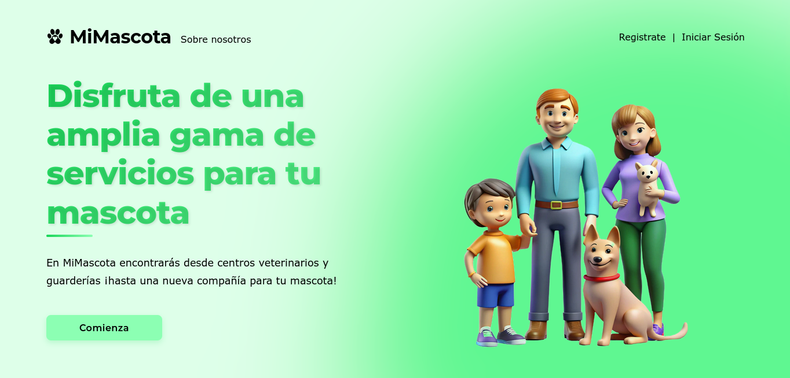
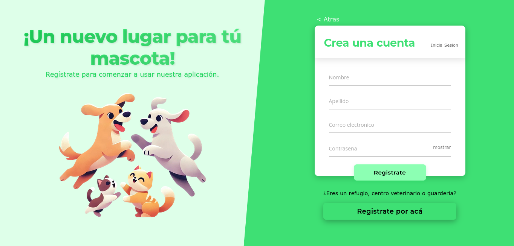
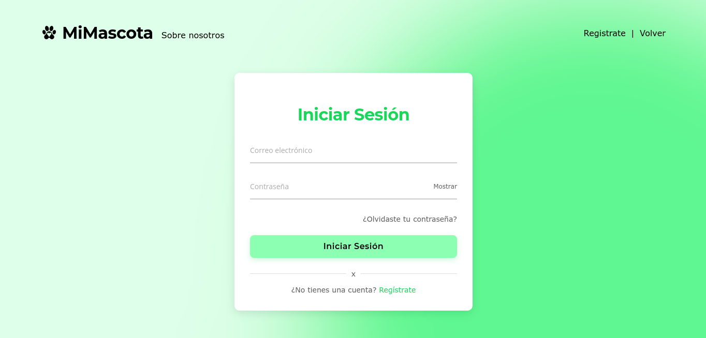
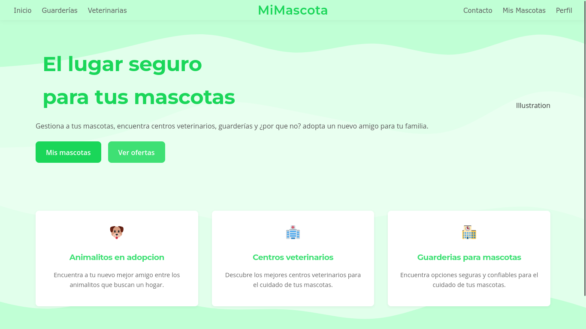
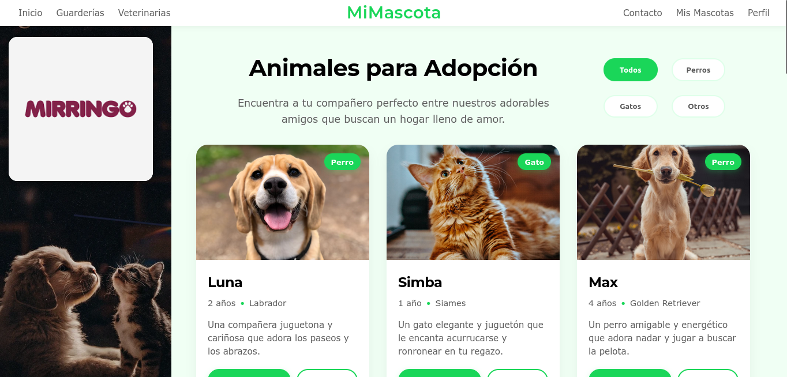
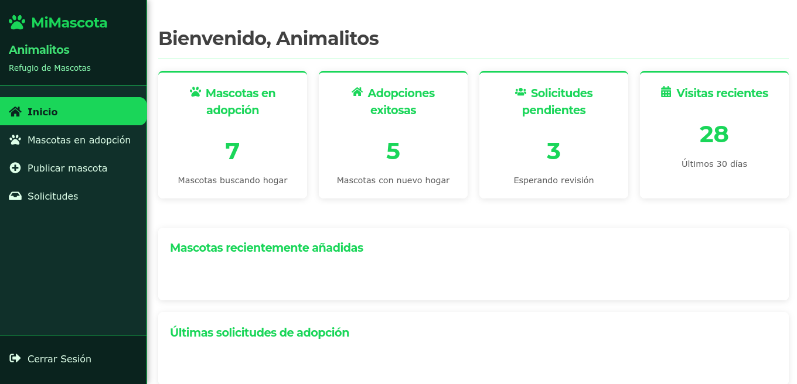
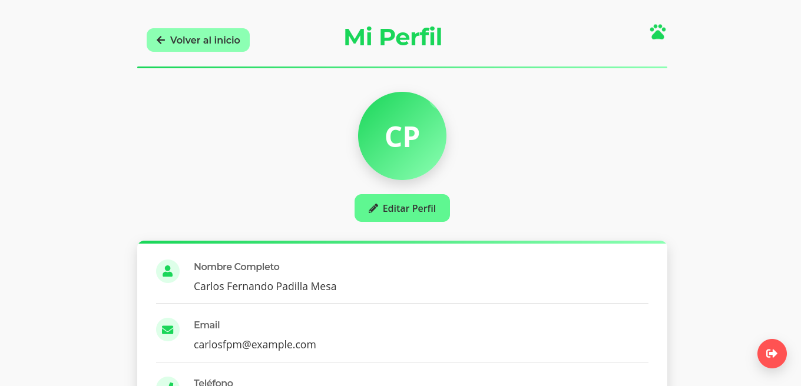
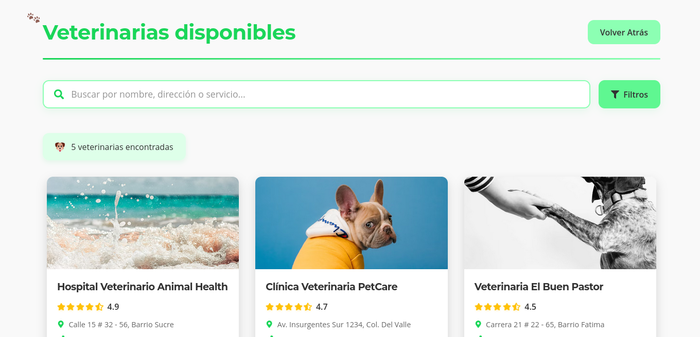
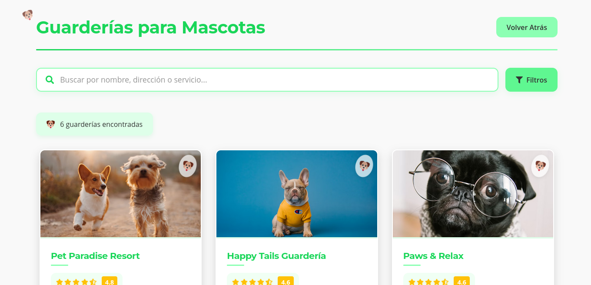

# Arquitectura de información y diseño de interacción

Sitemap (estructura general de navegación):
```
/inicio  
/registro / inicio de sesión
/home  
/refugios  
/mascotas disponibles para adopción 
/veterinarias  
/guarderias  
/perfil  
/contacto  
```

Wireframes:
#### Pantalla de inicio: Con banners y llamadas a la acción.

#### Pantalla de registro.

#### Pantalla de inicio de sesión.

#### Pantalla de home: Con acceso a refugios, adopciones, veterinarias y guarderías. (Para usuarios registrados)

#### Pantalla de adopciones: Lista de mascotas filtrable.

#### Pantalla de dasboard de refugios: Con acceso a estadísticas y gestión de mascotas.

#### Pantalla de perfil de usuario.

#### Pantalla de veterinarias.

#### Pantalla de guarderías.

#### Pantalla de contacto.


---

### Pasar a la siguiente sección: [Prototipado Rápido](06-prototipado-rapido.md)